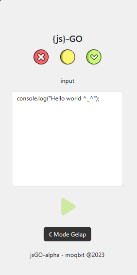
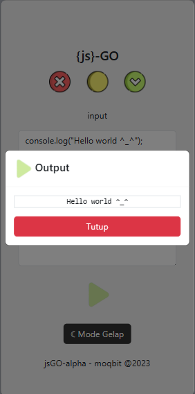

# jsGO
Simulator sintaks JavaScript sederhana yang didesain untuk keperluan pendidikan dalam memperkenalkan konsep dasar bahasa pemrograman JavaScript

A simple JavaScript syntax simulator designed for educational purposes in introducing basic JavaScript language concepts.

一个为教育目的设计的简单JavaScript语法模拟器，用于介绍基本的JavaScript语言概念。

